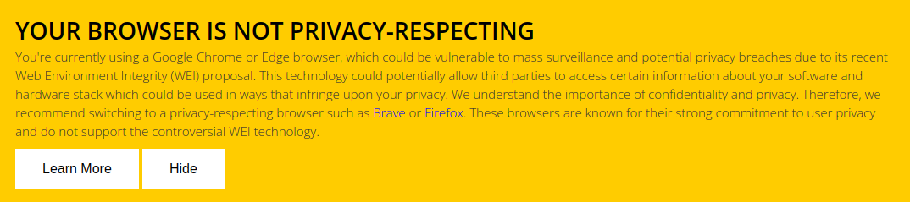

# Web Environment Integrity (WEI) Warning Banner WordPress Plugin

WEI Warning Banner is a WordPress plugin that shows up a banner to alert your website visitors of potential privacy concerns when their browser is utilizing Web Environment Integrity (WEI). The aim is to encourage the use of privacy-respecting browsers and promote awareness about internet privacy.

## Features

- Displays a fixed position warning banner at the bottom of the webpage if the user's browser uses WEI.
- Offers an admin settings page under the WordPress Settings menu, where admins can enable or disable the warning banner.

## Todo

- Allows the admin to edit the banner content and styling at the settings page.

## Installation

1. Download the plugin files and upload them to your `/wp-content/plugins/` directory.
2. Activate the plugin through the 'Plugins' menu in WordPress.
3. Navigate to Settings > WEI Warning Banner in your WordPress dashboard.
4. Enable or disable the warning banner as desired.

## Contribute

Your contributions are always welcome! Feel free to improve existing features, add new features or fix issues. You can send us a pull request on GitHub. 

## License

MIT

## Disclaimer

This plugin is a simple implementation and it is provided as-is with no guarantee or warranty. User discretion is advised while using this plugin on live sites.
